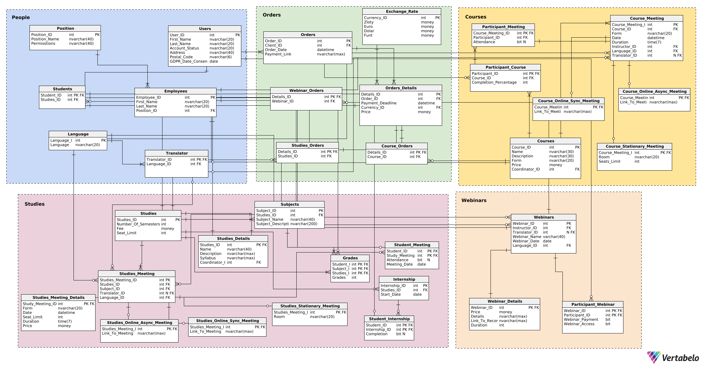

# DataBase-Project
Baza Danych utworzona przez Szymona Tyburczy oraz Marka Swakonia.

PBD 24/25 - Projekt realizowany w ramach przedmiotu Podstawy Baz Danych (PBD) na kierunku Informatyka AGH wydziału Informatyki.

### 

### Nasze założenia
Aby se

### Schemat bazy danych

Kliknij na obrazek, aby zobaczyć pełny schemat:

### Opis pracy

### Projektowanie

### Opis użytkowników i funkcje jakie mogą wykonywać:

Użytkownicy mogą przeglądać dostępne kursy, webinary oraz studia.

Mogą zapisywać się na zajęcia i zarządzać swoimi płatnościami.

Mają możliwość kontaktu z dyrektorem.

### Funkcje systemu:

Zarządzanie użytkownikami, kursami, studiami, i webinarami.

Rejestracja obecności na zajęciach.

Integracja z systemem płatności.

Generowanie raportów dla dyrektora.

Implementacja

### Projekt oraz schemat bazy danych

Kategoria People: Opisuje użytkowników, pracowników i tłumaczy.

Kategoria Webinars: Przechowuje informacje o webinarach.

Kategoria Studies: Dotyczy studiów, przedmiotów i spotkań studyjnych.

Kategoria Courses: Dotyczy kursów i ich różnych rodzajów spotkań.

Kategoria Orders: Przechowuje informacje o zamówieniach i płatnościach.

### Opisy tabel

Kategoria People: Szczegóły dotyczące tabel użytkowników, pracowników i tłumaczy.

Kategoria Webinars: Szczegóły dotyczące tabel webinarów i ich nagrań.

Kategoria Studies: Szczegóły dotyczące tabel przedmiotów, studiów i spotkań studyjnych.

Kategoria Courses: Szczegóły dotyczące tabel kursów i różnych rodzajów spotkań.

Kategoria Orders: Szczegóły dotyczące zamówień i płatności.

### Generowanie danych

Dane zostały wygenerowane przy użyciu ChataGPT oraz strony mockaroo.com

Widoki

Triggery:

Indeksy: optymalizują wyszukiwanie danych.

Uprawnienia: przypisane odpowiednich ról

